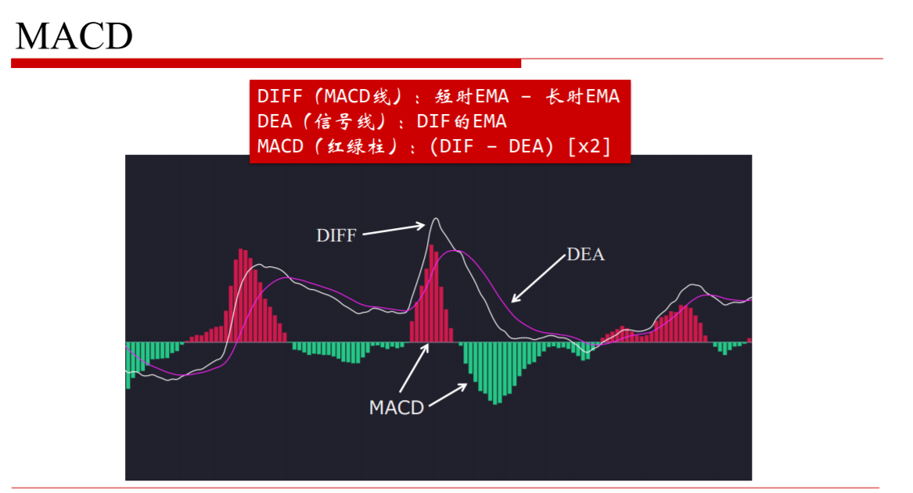
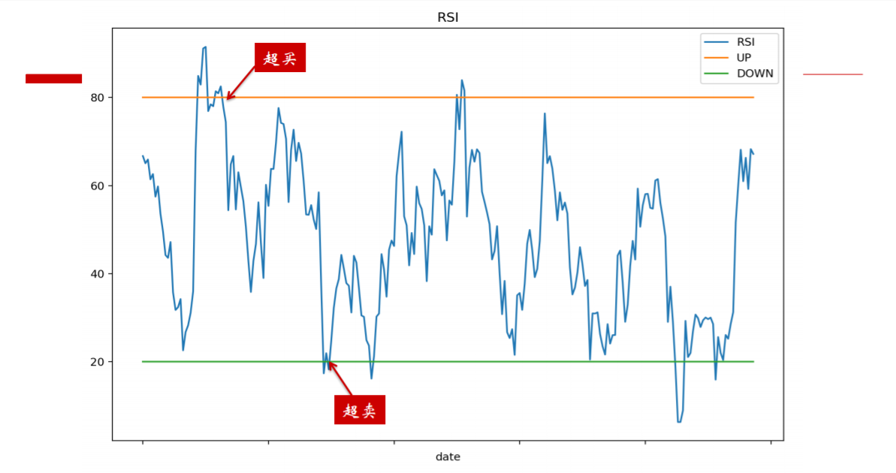
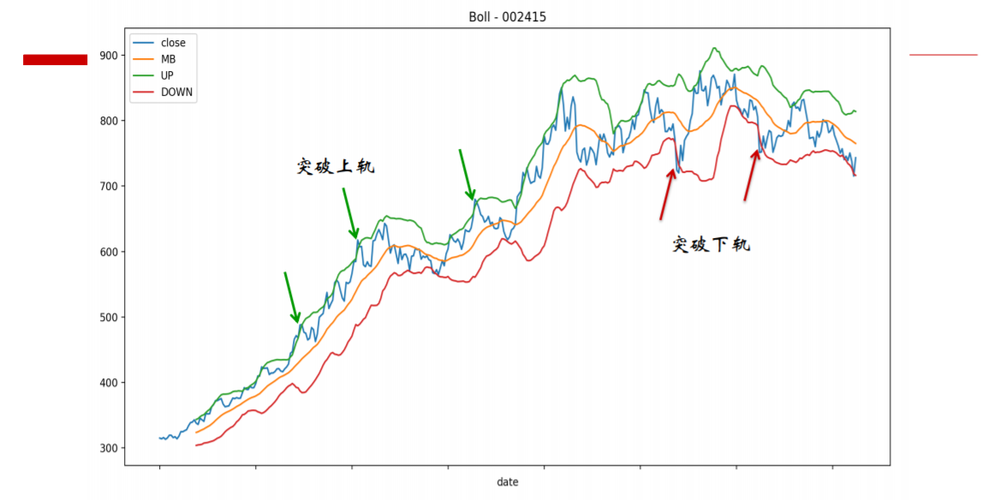
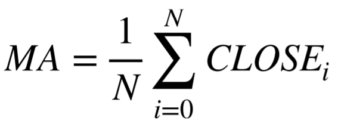
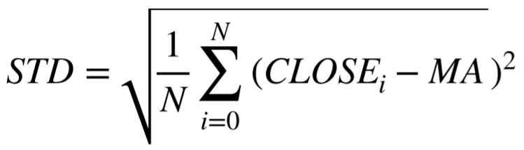
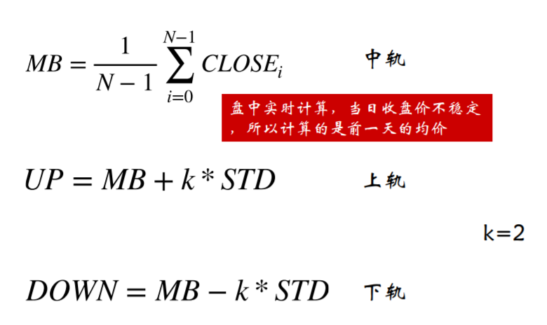
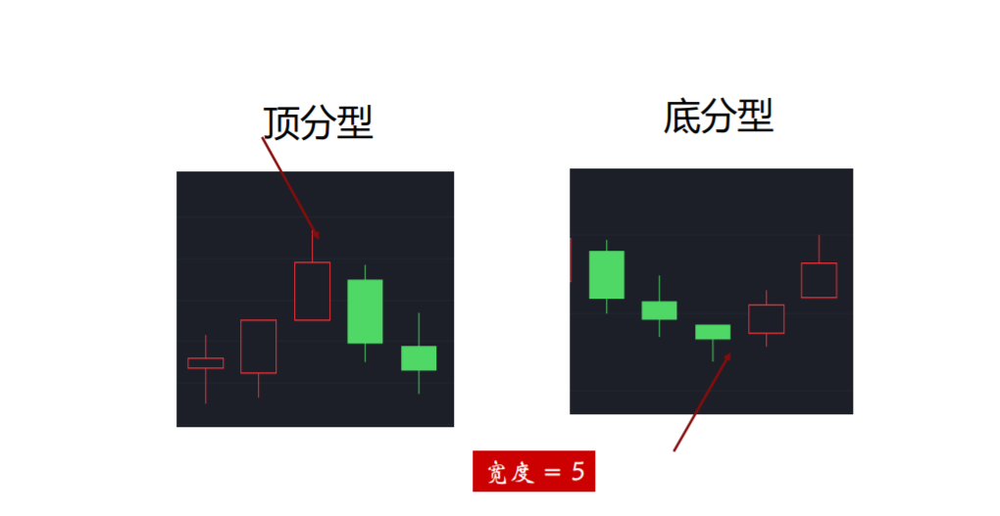

# 量化课堂初阶课程笔记
## 第一课_量化投资的发展和理工生跨界做量化的开启姿势 20191021
* 你为什么要做交易  
    1. 为了赚钱，早点退休
* 你为什么要学量化  
    1. 为了节省时间，利用代码来帮助自己更好的买卖股票
* 你做量化有什么优势  
    1. 会代码，懂得一点金融知识
* 你有什么明确的投资目标
    1. 提高收益率达到每年20%，实现财富自由
* 今天的双均线策略例子有什么严重漏洞
    1. 一年的回测时间不够，最好要穿越一个牛熊市
    2. 240个交易，需要仔细看买卖价格，头寸，不能单看曲线收益
    3. 设置成交比例order_volume_ratio应设置在1/10
    4. 曲线金叉和死叉，只设置了第一次上穿或下穿

## 第2课_认识量化信号系统 20191023
* MACD： 代表市场的趋势变化，金叉买入，死叉卖出。异同移动平均线，由双指数移动平均线发展而来。
    1. 买卖信号  
          
        * 金叉，DIFF上穿DEA，前一日DIFF在DEA下面，当日DIFF在DEA上面 DIFFi-1 <= DEAi-1 && DIFFi > DEAi  
        * 死叉，DIFF下穿DEA，前一日DIFF在DEA上面，当日DIFF在DEA下面 DIFFi-1 >= DEAi-1 && DIFFi < DEAi
    2. 计算公式：
    参数：short=12, long=26, m=9  
    快线DIF=快的指数移动平均线(EMA12) - 慢的指数移动平均线(EMA26)
    MACD = (快线DIF-DIF的9日加权移动平均线DEA)*2 
        1. 计算指数移动平均值EMA  
            * α为平滑指数，一般取2/(N+1)  
            * EMAtoday = α * Pricetoday + ( 1 - α ) * EMAyestorday   
            * 快线EMA: EMA(12)= 2/13 * Pricetoday + 11/13 * EMAyestoday  
            * 慢线EMA: EMA(26)= 2/27 * Pricetoday + 25/27 * EMAyestoday
        2. 计算DIF的9日加权移动平均值EMA, 名DEA  
            * DEAtoday = α * DIFtoday + ( 1 - α ) * DIFyesterday  
            * DEA(9) = 2/10 * DIFtoday + 8/10 * DIFyesterday
* RSI:相对强弱指标，代表市场买卖意愿的强弱。一定时间窗口内，上涨幅度之和占整体涨跌幅度绝对值之和的比例。
    1. 买卖信号  
          
        * 超卖区： RSI<20 买入  
        * 超买区： RSI>80 卖出
    2. 计算公式
        * 根据一段时期内的收盘平均涨数和平均收盘跌数分析市场走势，RSI的计算在某一阶段价格上涨所产生的波动占整个波动的百分比。  
        * A--N日内收盘涨幅之和  
        * B--N日内收盘跌幅之和（取正值）  
        * N日RS=A/B*100%  
        * N日RSI=A/(A+B)*100=RS/(1+RS)*100=100-100/(1+RS)
* BOLL:布林线，基于统计学的标准差原理，三条轨道，上轨：压力线，中轨：价格均线，下轨：支撑线
    1. 买卖信号  
         
        * 上穿压力线，卖出  
        * 下穿支撑线，买入
        * 上穿中界线，加码  
        * 下穿中界线，卖出  
    2. 计算公式  
        * 均值MA=N日内收盘价之和/N   
        *   
        * 标准差MD=平方根N日的(C-MA)的两次方之和除以N  
        *   
        * 中轨线=N日的移动平均线,MB=N日的MA  
        * 上轨线=中轨线+两倍标准差,UP=MB+2MD  
        * 下轨线=中轨线-两倍标准差,DN=MB-2MD  
        *   
* 分形信号：顶分形与底分型
    1. 分形信号
        *     
             

